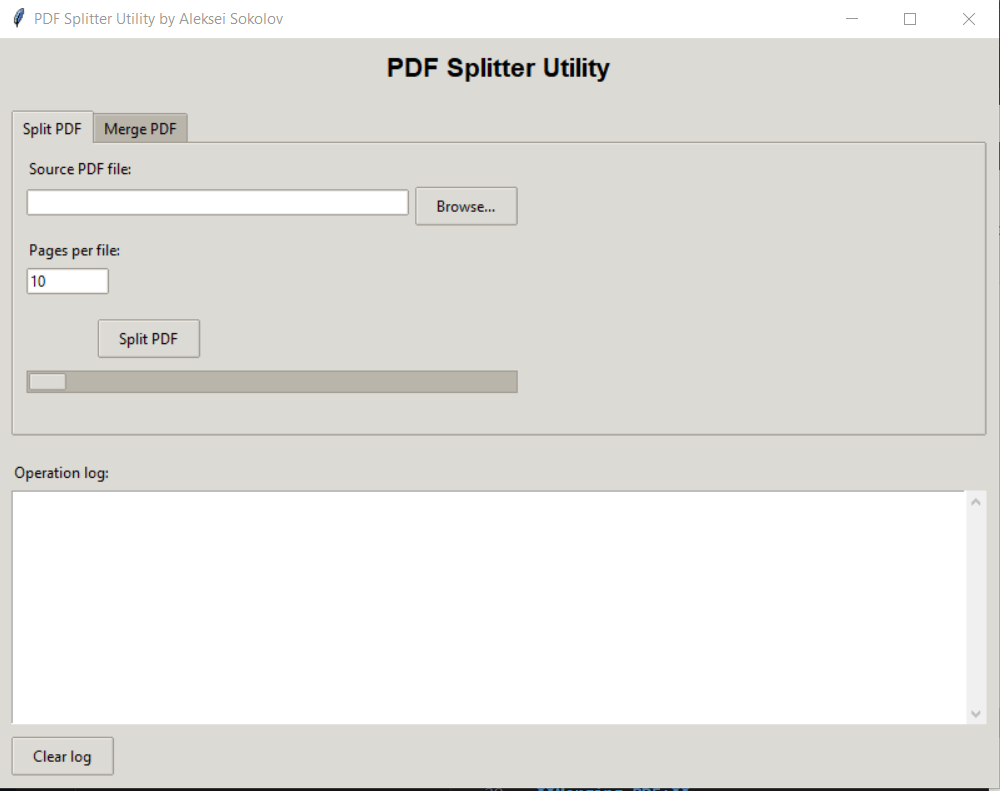

# PDF Splitter Utility

[English](#english) | [Русский](#русский)


---

<a name="english"></a>
## English

Simple utility for splitting and merging PDF files.

### Usage

#### Graphical Interface

```bash
python pdf_splitter_gui.py
```

or

```bash
run_gui.bat
```

**Splitting PDF:**
1. "Split PDF" tab → select file → specify number of pages → "Split PDF"

**Merging PDF:**
1. "Merge PDF" tab → select folder with PDF files → "Merge PDF"

#### Console Version

```bash
python pdf_splitter.py
```

Follow the menu instructions.

### Building Executable

**Quick build:**
```bash
build.bat
```

or

```bash
build_advanced.bat
```

The executable will be created in the `dist/PDF_Splitter.exe` folder.

**Install dependencies:**
```bash
pip install -r requirements.txt
```

---

<a name="русский"></a>
## Русский

Простая утилита для разделения и объединения PDF файлов.

### Использование

#### Графический интерфейс

```bash
python pdf_splitter_gui.py
```

или

```bash
run_gui.bat
```

**Разделение PDF:**
1. Вкладка "Split PDF" → выберите файл → укажите количество страниц → "Split PDF"

**Объединение PDF:**
1. Вкладка "Merge PDF" → выберите папку с PDF файлами → "Merge PDF"

#### Консольная версия

```bash
python pdf_splitter.py
```

Следуйте инструкциям в меню.

### Сборка исполняемого файла

**Быстрая сборка:**
```bash
build.bat
```

или

```bash
build_advanced.bat
```

Исполняемый файл будет создан в папке `dist/PDF_Splitter.exe`

**Установка зависимостей:**
```bash
pip install -r requirements.txt
```
